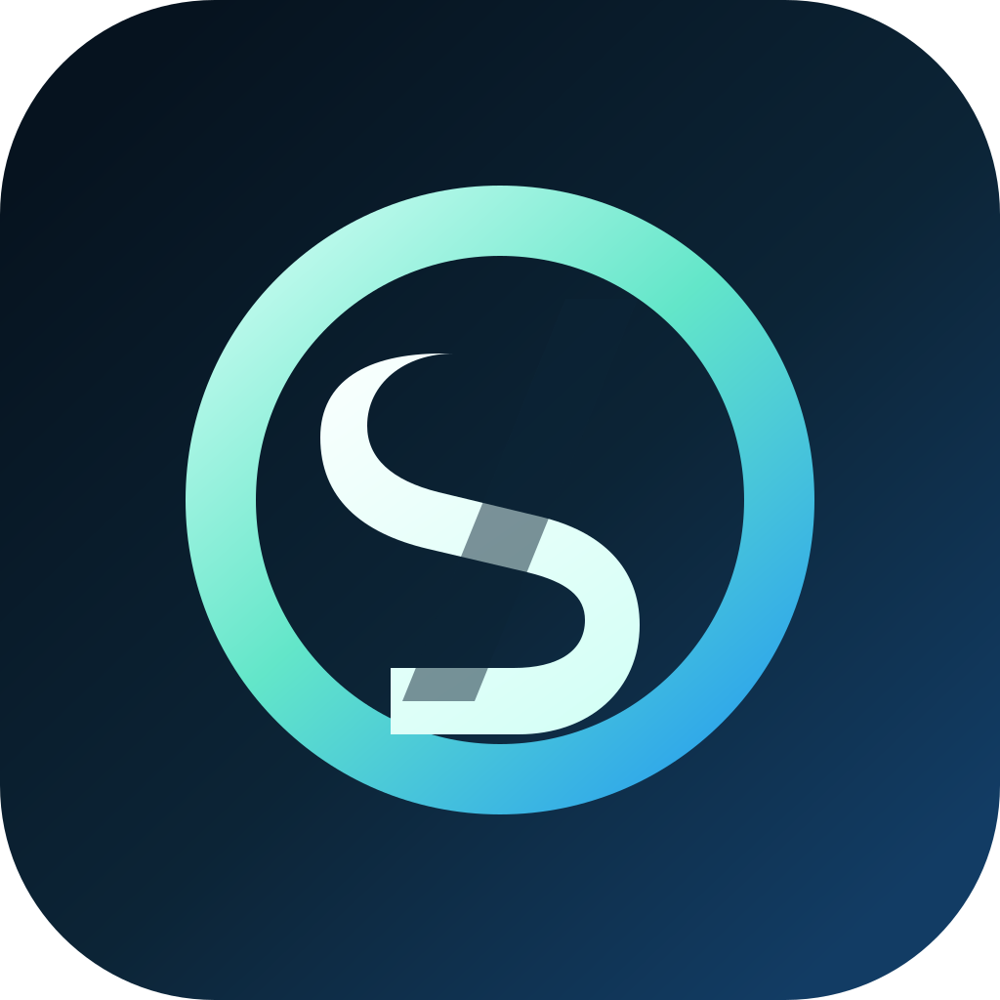
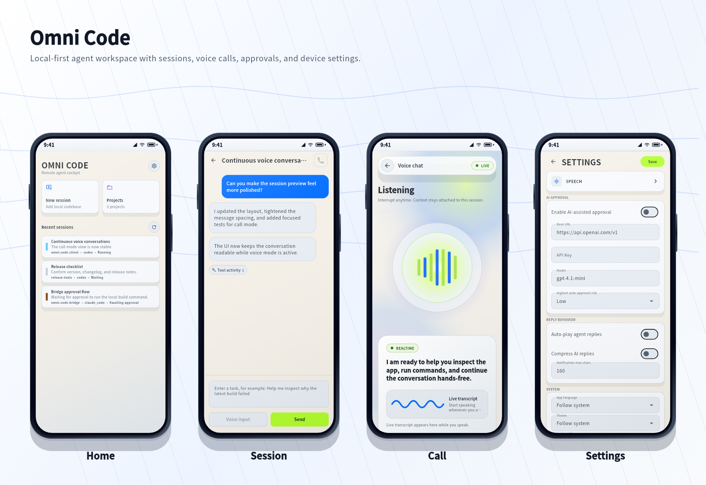

<p align="center">
  
</p>

<h1 align="center">Omni Code Client</h1>

<p align="center">
  <a href="LICENSE"></a>
  <a href="https://flutter.dev"></a>
  
  <a href="https://github.com/omni-stream-ai/omni-code/releases"></a>
</p>

<p align="center">
  <a href="docs/zh/README.md">中文文档</a>
</p>

---

A cross-platform Flutter client for desktop agent sessions. Available on both desktop and mobile, its core goal is to let you complete product design, development, and testing workflows from mobile or via voice input.

Connects to [omni-code-bridge](https://github.com/omni-stream-ai/omni-code-bridge), extending desktop agent capabilities to multiple devices and voice interaction.

See also: [Plugin Writing Guide](https://github.com/omni-stream-ai/omni-code-plugins/blob/main/docs/en/plugin-manifest-guide.md) | [Plugin Repository](https://github.com/omni-stream-ai/omni-code-plugins)

## Preview



## Roadmap (V1)

1. **Refine core interactions** — Improve sessions, approvals, notifications, and other key workflows
2. **Cross-project and cross-session voice interaction** — Seamlessly switch between multiple projects and sessions by voice
3. **Task orchestration** — Support multi-step task orchestration and automated execution

## Install

| Platform | Download |
| --- | --- |
| Android | [APK (arm64)](https://github.com/omni-stream-ai/omni-code/releases/latest/download/omni-code-android-arm64-v8a.apk) · [APK (arm)](https://github.com/omni-stream-ai/omni-code/releases/latest/download/omni-code-android-armeabi-v7a.apk) · [APK (x86_64)](https://github.com/omni-stream-ai/omni-code/releases/latest/download/omni-code-android-x86_64.apk) |
| Windows | [zip](https://github.com/omni-stream-ai/omni-code/releases/latest/download/omni-code-windows-x86_64.zip) |
| Linux | [tar.gz](https://github.com/omni-stream-ai/omni-code/releases/latest/download/omni-code-linux-x86_64.tar.gz) |
| macOS | Homebrew ↓ |
| iOS | Build from source |

**Homebrew (macOS):**

```bash
brew install omni-stream-ai/omni-code/omni-code
```

**Arch Linux (AUR):**

```bash
yay -S omni-code-bin
```

**Nix / NixOS (x86_64 Linux, built from source by default):**

```bash
nix run github:omni-stream-ai/omni-code
```

Select either package explicitly:

```bash
nix run github:omni-stream-ai/omni-code#omni-code-bin
nix run github:omni-stream-ai/omni-code#omni-code
```

Install either package into your profile:

```bash
nix profile install github:omni-stream-ai/omni-code#omni-code-bin
# Or build and install from source
nix profile install github:omni-stream-ai/omni-code#omni-code
```

## Development

```bash
flutter pub get
flutter run
```

Sentry error and performance monitoring is enabled only when a DSN is supplied:

```bash
flutter run \
  --dart-define=SENTRY_DSN=https://examplePublicKey@o0.ingest.sentry.io/0 \
  --dart-define=SENTRY_ENVIRONMENT=development \
  --dart-define=SENTRY_TRACES_SAMPLE_RATE=0.1 \
  --dart-define=SENTRY_PROFILES_SAMPLE_RATE=0.1 \
  --dart-define=SENTRY_MEMORY_THRESHOLD_MB=1024
```

Request bodies, console breadcrumbs, UI text, credentials, URL query strings,
and project/session identifiers are excluded from Sentry events.

Release builds read `SENTRY_DSN` from the GitHub repository variable with the
same name. `SENTRY_TRACES_SAMPLE_RATE` controls transaction sampling and
`SENTRY_PROFILES_SAMPLE_RATE` controls profiling; both default to `0.1`.
`SENTRY_MEMORY_THRESHOLD_MB` controls the sustained-memory alert threshold and
defaults to `1024`. The app samples process CPU and memory once per minute and
reports only sustained threshold breaches or recovered main-isolate stalls.
Configure these under **Settings > Secrets and variables > Actions > Variables**;
no Sentry auth token is needed. All monitoring stops when error reporting is
disabled in the app settings.

## Contributing

See [CONTRIBUTING.md](CONTRIBUTING.md). The project TODO board is at [GitHub Projects](https://github.com/orgs/omni-stream-ai/projects/2).

## License

[MIT](LICENSE)
