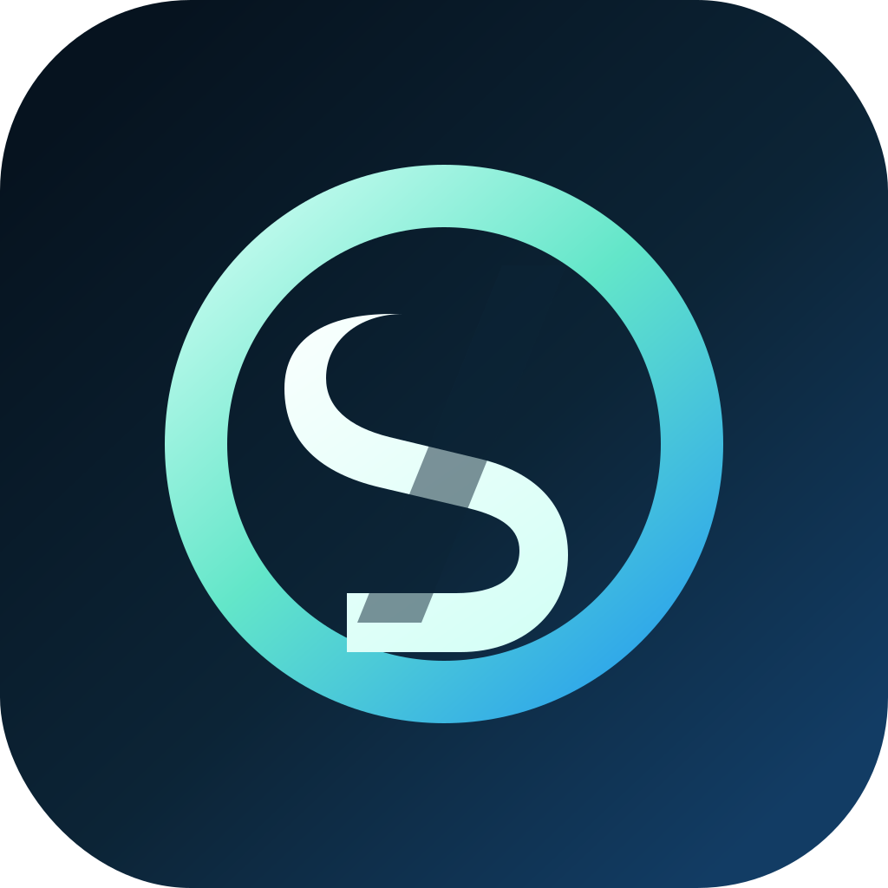
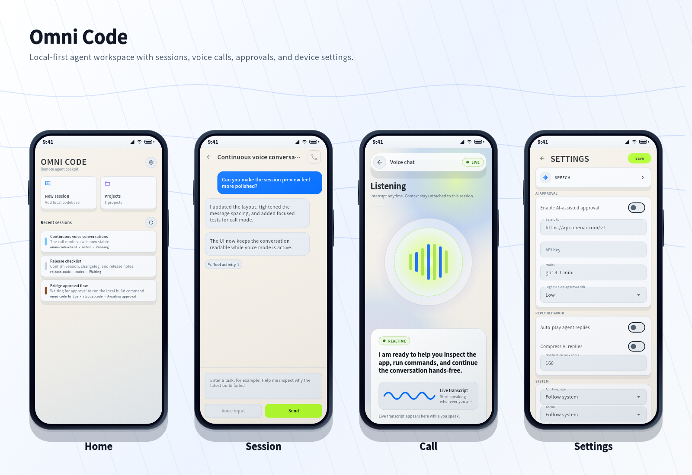

<p align="center">
  
</p>

<h1 align="center">Omni Code Client</h1>

<p align="center">
  <a href="LICENSE"></a>
  <a href="https://flutter.dev"></a>
  
  <a href="https://github.com/omni-stream-ai/omni-code/releases"></a>
</p>

<p align="center">
  <a href="README.md">English</a>
</p>

---

Omni Code 是一个跨平台 Flutter 客户端，支持桌面端和移动端，核心目标是让你即使在移动端或通过语音，也能完成产品设计、开发、测试等全部工作流。

它连接 [omni-code-bridge](https://github.com/omni-stream-ai/omni-code-bridge)，让桌面 agent 的能力延伸到多端和语音交互中。

## 预览



## 路线图 (V1)

1. **完善基本交互** — 优化会话、审批、通知等核心流程的体验
2. **跨项目跨会话语音交互** — 用语音在多个项目和会话间无缝切换
3. **任务编排** — 支持多步骤任务的编排与自动化执行

## 安装

| 平台 | 下载 |
| --- | --- |
| Android | [APK (arm64)](https://github.com/omni-stream-ai/omni-code/releases/latest/download/omni-code-android-arm64-v8a.apk) · [APK (arm)](https://github.com/omni-stream-ai/omni-code/releases/latest/download/omni-code-android-armeabi-v7a.apk) · [APK (x86_64)](https://github.com/omni-stream-ai/omni-code/releases/latest/download/omni-code-android-x86_64.apk) |
| Windows | [zip](https://github.com/omni-stream-ai/omni-code/releases/latest/download/omni-code-windows-x86_64.zip) |
| Linux | [tar.gz](https://github.com/omni-stream-ai/omni-code/releases/latest/download/omni-code-linux-x86_64.tar.gz) |
| macOS | Homebrew ↓ |
| iOS | 自行编译 |

**Homebrew（macOS）：**

```bash
brew tap omni-stream-ai/homebrew-omni-code
brew install --cask omni-code
```

**Arch Linux（AUR）：**

```bash
yay -S omni-code-bin
```

## 开发

```bash
flutter pub get
flutter run
```

## 贡献

参见 [CONTRIBUTING.md](CONTRIBUTING.md)。项目 TODO 看板在 [GitHub Projects](https://github.com/orgs/omni-stream-ai/projects/2)。

## 许可证

[MIT](LICENSE)
