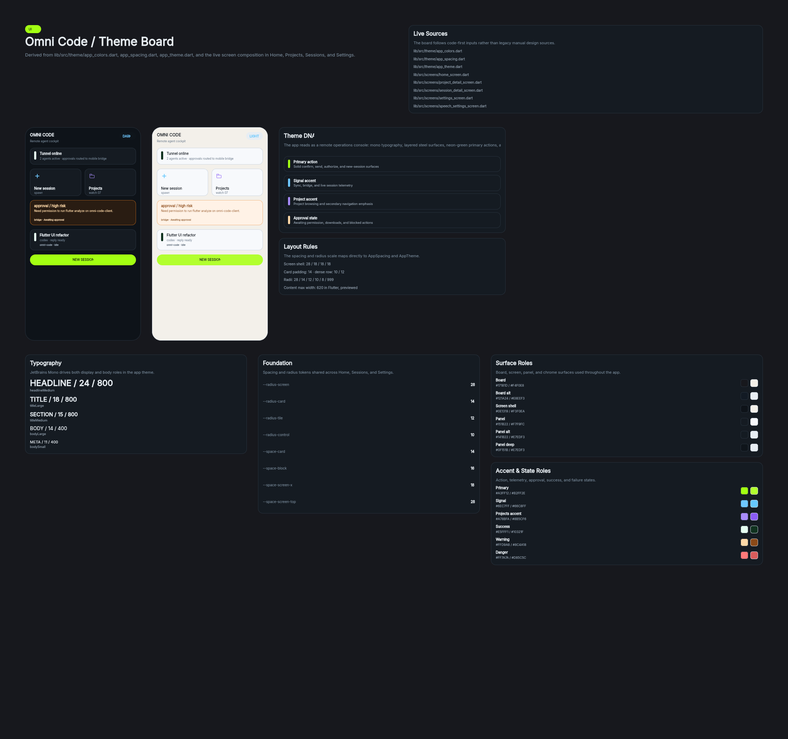
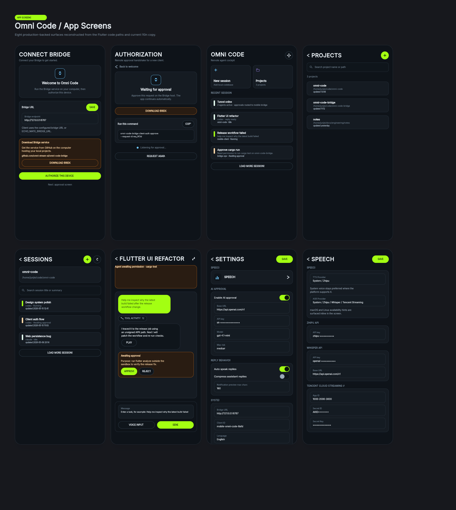

# Omni Code Designs

This directory stores the code-derived OpenPencil design sources for Omni Code.

## Files

- `omni-code-theme-from-code.pen`: OpenPencil theme board generated from the current Flutter theme and screen code.
- `omni-code-screens-from-code.pen`: OpenPencil screen draft generated from the current Flutter screen structure.
- `omni-code-theme-from-code.png`: exported preview image from `omni-code-theme-from-code.pen`.
- `omni-code-screens-from-code.png`: exported preview image from `omni-code-screens-from-code.pen`.

Legacy `.op` design files have been removed. `.pen` is the only maintained design format in this repo.

## Workflow

1. Run `node scripts/generate_openpencil_design_from_code.mjs` to regenerate the code-derived `.pen` design drafts.
2. Re-export the preview PNGs after meaningful visual changes.
3. Treat the generated `.pen` files as the current design handoff for the Flutter app.
